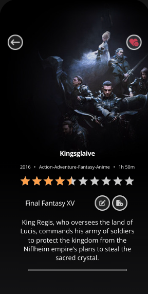
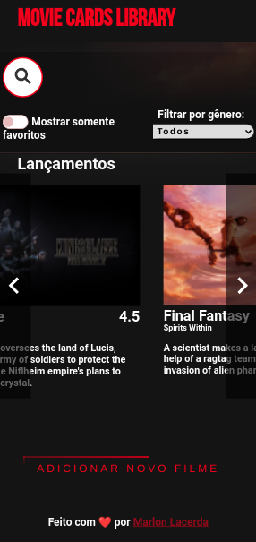

<p>
  
  
  <a href="https://github.com/marlondlacerda/movie-card-library-crud/commits/main">
    
  </a>
</p>

# Boas vindas ao repositório do projeto Movie Cards CRUD! 📺

<div align="center">
  
  <div align="left" style="display: inline_block">
    <h2>Módulo: DESENVOLVIMENTO FRONT-END</h2>
    <p>
      Repositório possuí projeto desenvolvido no período que estive na <b>Trybe</b>, abordando sobre criação de componentes, página, criação de formulário e mudança de estados no <b>REACT</b>.</p>
  </div>
  <br>
</div>

## Preview
<div align="left" style="display: inline_block">
  <a href="https://movie-card-library-crud.herokuapp.com/">Clique aqui</a> para ter acesso a um preview do App.
</div>

---

<div align="center">
  
  
</div>

## Habilidades
- Utilizar o componentDidMount para executar uma ação após o componente ser inserido no DOM;
- Utilizar o shouldComponentUpdate para avaliar se uma atualização do componente deve ou não acontecer naquele momento;
- Utilizar o componentDidUpdate para executar uma ação após o componente ser atualizado;
- Utilizar o componentWillUnmount para realizar uma ação antes de o componente ser desmontado;
- Utilizar o props.children para acessar os filhos de um componente React e interagir com eles;
- Utilizar o componente BrowserRouter corretamente;
- Criar links de navegação na aplicação com o componente Link ;
- Criar rotas, mapeando o caminho da URL com o componente correspondente, via Route ;
- Estruturar e organizar as rotas da sua aplicação com o componente Switch ;
- Usar o componente Redirect pra alternar entre rotas.

## O que foi desenvolvido
- [Na Parte 1](https://github.com/marlondlacerda/moviecardlibrary) - Uma biblioteca de cartões de filmes utilizando React. A biblioteca deverá possuir um cabeçalho e uma lista de cartões. Cada cartão representa um filme e possui uma imagem, título, subtítulo, sinopse e avaliação.
- [Na Parte 2](https://github.com/marlondlacerda/moviecardlibrary-stateful) - A aplicação será composta por um <code>conjunto de componentes</code> React e controlada por estados.
- Agora - Foi criado um CRUD de cartões de filmes em React. A sigla CRUD significa, Create, Read, Update and Delete, então deve ser possível realizar as seguintes operações nesse projeto:

  - Adicionar um novo filme à lista - CREATE;
  - Listar todos os filmes cadastrados, com uma página de informações resumidas sobre cada filme e uma página de informações detalhadas de um filme selecionado - READ;
  - Editar um filme da lista - UPDATE;
  - E apagar um filme da lista - DELETE;

---

 ## Instruções para instalar e rodar os testes de cada requisito

```bash
# Clone o repositório
  git clone git@github.com:marlondlacerda/movie-card-library-crud.git

# Entre na pasta do repositório que você acabou de clonar:
  cd movie-card-library-crud

# Instale as dependências e inicialize o projeto
  npm install

# Use o comando "npm start" para iniciar o aplicativo no navegador.

# Entre no Vs Code para verificar os arquivos usando o atalho no terminal:
  code .

#  A pasta tests contém os testes que verifica se as funções estão atendendo o que foi pedido

# Leia os Requisitos do Projeto logo abaixo explicando o que cada requisito propõem

# Para rodar os tests use o atalho no terminal:
  npm run test

# Para ver as mudanças realizadas para o deploy e coisas adicionais use o comando
  git checkout deploy
# e depois para instalar as dependências use o comando
  npm run install
# depois de instalar o projeto novamente, use o comando
  npm run start
```
---

<details>
  <summary>Requisitos do projeto</summary>
- [x] 1 - Renderize BrowserRouter no componente App usando rotas.

  - Você deve utilizar um BrowserRouter pra criar as rotas da sua aplicação. As urls de cada página devem ser desenvolvidas conforme especificado na seção O que será desenvolvido.

- [x] 2 - Faça uma requisição para buscar e mostrar a lista de filmes quando MovieList for montado

  - Para buscar a lista, você deve utilizar a função `getMovies` importada do módulo `movieAPI` em `MovieList`. Essa função retorna uma promise. A requisição deve ser feita no momento em que o MovieList for montado no DOM. Enquanto a requisição estiver em curso, `MovieList` deve renderizar o componente `Loading`, como ilustrado na imagem a seguir.

- [x] 3 - Insira um link para a página de detalhes de um filme dentro de `MovieCard`

  - Todos os `MovieCards` devem possuir em seu conteúdo, pelo menos, o título, a sinopse e um link com o texto "VER DETALHES" que aponta para a rota `movies/:id`, onde `:id` é o id do filme. Esta rota exibirá informações detalhadas de um filme.

- [x] 4 - Faça uma requisição para buscar o filme que deverá ser renderizado dentro de `Movie Details`

  - `MovieDetails` se comporta de forma muito semelhante ao `MovieList`. Ao ser montado, deve fazer uma requisição utilizando a função `getMovie`, se atente para o nome da função que é muito semelhante ao de outra função que já utilizamos, a `getMovies`, do módulo `movieAPI`, passando o id do filme. O componente `Loading` deve ser renderizado enquanto a requisição estiver em curso. Após terminar, deve-se renderizar um card com mais detalhes sobre o filme.

- [x] 5 - Realize uma requisição para buscar o filme que será editado em `EditMovie`.

  - Ao ser montada, a página de edição do filme deve fazer uma requisição pra buscar o filme que será editado e deve, ao ter seu formulário submetido, atualizar o filme e redirecionar a página pra rota raíz.

- [x] 6 - Insira um link na página inicial para `NewMovie` para criar novos cartões

  - O link deve conter o texto "ADICIONAR CARTÃO" e apontar para a rota `/movies/new`, contendo um formulário para criar novos cartões.

  - Na rota `/movies/new`, utilizando a callback passada para `MovieForm`, NewMovie deve criar um novo cartão utilizando a função `createMovie` do módulo `movieAPI`. Após o fim da requisição, `NewMovie` deve redirecionar o app para a página inicial, contento o novo cartão.

### Bonus:

- [x] 7 - Adicione um link para deletar um cartão em MovieDetails

  - Ao clicar neste link, faça uma requisição utilizando a função `deleteMovie` do módulo `movieAPI`. Após finalizar a requisição, redirecione o app para a página inicial. O cartão apagado não deverá mais se encontrar na lista.

</details>

---

## RECURSOS ADICIONAIS DESENVOLVIDOS POR MIM
 [PART 1](https://github.com/marlondlacerda/moviecardlibrary#recursos-adicionais-desenvolvidos-por-mim)

  [PART 2](https://github.com/marlondlacerda/moviecardlibrary-stateful#recursos-adicionais-desenvolvidos-por-mim)

  PART 3:
  - Adicionei novos inputs para os formulários, como Ano e duração.
  - Por padrão, todos os filmes tem a propriedade `bookmarked` como `false`.
  - Na página detalhada do filme ao clicar no botão de favoritos, o filme é marcado como favorito.
  - Agora todas as mudanças são salvas no localStorage.
  - Implementei Docker para que o aplicativo virasse um container.
  - Todas as posíveis rotas retornam um componente `NotFound` caso não seja encontrado.
  - Adicionei uma biblioteca `React simple rating` para renderizar os estrelas ao invés de números na página de detalhes do filme.
  - Deploy usando Heroku
     - Assim como já peguei um pouco de prática usando vercel, continuei usando o Heroku para praticar mais.

---

<div align="left">
  <a href="https://github.com/marlondlacerda/trybe-projetos">Voltar para o repositório principal</a>
</div>
<div align="center">
  
  [⬆ Voltar para o topo](#boas-vindas-ao-repositório-do-projeto-movie-cards-crud-)

</div>
